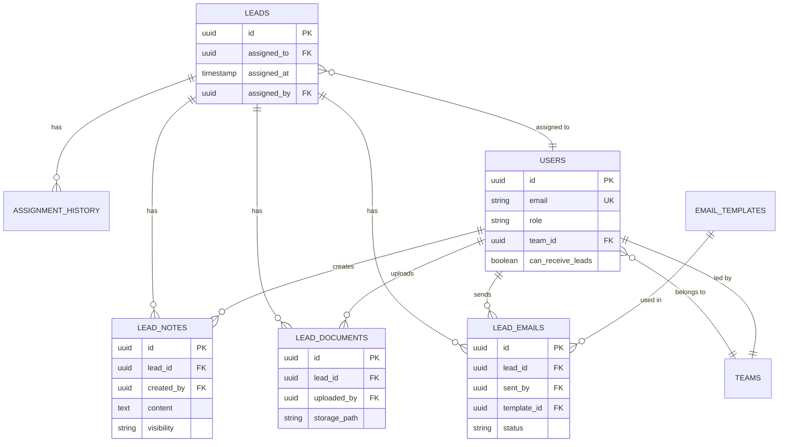

# Database Schema - Lead Management

> **⚠️ مهم جداً:** هذا الملف يحتوي على كل متطلبات قاعدة البيانات اللي لازم تتنفذ

---

## 📋 Table of Contents

1. [Existing Tables (Updates Needed)](#existing-tables)
2. [New Tables Required](#new-tables)
3. [Relationships](#relationships)
4. [Indexes](#indexes)
5. [Constraints](#constraints)
6. [Migration Plan](#migration-plan)
7. [Sample Data](#sample-data)

---

## 1️⃣ Existing Tables (Updates Needed)

### `leads` Table - التعديلات المطلوبة

```sql
-- إضافة أعمدة جديدة للـ leads table

ALTER TABLE leads 
ADD COLUMN IF NOT EXISTS assigned_to UUID REFERENCES users(id) ON DELETE SET NULL,
ADD COLUMN IF NOT EXISTS assigned_at TIMESTAMP WITH TIME ZONE,
ADD COLUMN IF NOT EXISTS assigned_by UUID REFERENCES users(id) ON DELETE SET NULL;

-- Index للأداء
CREATE INDEX IF NOT EXISTS idx_leads_assigned_to ON leads(assigned_to);
CREATE INDEX IF NOT EXISTS idx_leads_assigned_at ON leads(assigned_at);

-- Comments للتوضيح
COMMENT ON COLUMN leads.assigned_to IS 'الموظف المسؤول عن هذا الـ Lead';
COMMENT ON COLUMN leads.assigned_at IS 'تاريخ ووقت الإسناد';
COMMENT ON COLUMN leads.assigned_by IS 'من قام بعملية الإسناد';
```

**الأعمدة الجديدة:**
- `assigned_to` - UUID - الموظف المسؤول
- `assigned_at` - TIMESTAMP - تاريخ الإسناد
- `assigned_by` - UUID - من قام بالإسناد

---

## 2️⃣ New Tables Required

### A. `users` Table - جدول الموظفين

```sql
CREATE TABLE IF NOT EXISTS users (
    id UUID PRIMARY KEY DEFAULT gen_random_uuid(),
    name VARCHAR(255) NOT NULL,
    email VARCHAR(255) NOT NULL UNIQUE,
    phone VARCHAR(50),
    role VARCHAR(50) NOT NULL DEFAULT 'user',
    department VARCHAR(100),
    team_id UUID REFERENCES teams(id) ON DELETE SET NULL,
    
    -- Assignment settings
    can_receive_leads BOOLEAN DEFAULT true,
    daily_lead_limit INTEGER DEFAULT NULL,
    current_lead_count INTEGER DEFAULT 0,
    
    -- Status
    is_active BOOLEAN DEFAULT true,
    is_email_verified BOOLEAN DEFAULT false,
    
    -- Auth (if using custom auth)
    password_hash VARCHAR(255),
    last_login_at TIMESTAMP WITH TIME ZONE,
    
    -- Metadata
    created_at TIMESTAMP WITH TIME ZONE DEFAULT CURRENT_TIMESTAMP,
    updated_at TIMESTAMP WITH TIME ZONE DEFAULT CURRENT_TIMESTAMP,
    
    -- Constraints
    CONSTRAINT users_email_lowercase CHECK (email = LOWER(email)),
    CONSTRAINT users_role_valid CHECK (role IN ('admin', 'team_lead', 'sales_manager', 'counselor', 'viewer'))
);

-- Indexes
CREATE INDEX idx_users_email ON users(email);
CREATE INDEX idx_users_role ON users(role);
CREATE INDEX idx_users_team_id ON users(team_id);
CREATE INDEX idx_users_is_active ON users(is_active);
CREATE INDEX idx_users_can_receive_leads ON users(can_receive_leads);

-- Comments
COMMENT ON TABLE users IS 'جدول الموظفين في النظام';
COMMENT ON COLUMN users.can_receive_leads IS 'هل يمكن إسناد leads جديدة لهذا الموظف';
COMMENT ON COLUMN users.daily_lead_limit IS 'الحد الأقصى من الـ leads يومياً (NULL = غير محدود)';
```

**Sample Roles:**
- `admin` - مدير النظام
- `team_lead` - قائد الفريق
- `sales_manager` - مدير مبيعات
- `counselor` - مستشار
- `viewer` - مشاهد فقط

---

### B. `teams` Table - جدول الفرق

```sql
CREATE TABLE IF NOT EXISTS teams (
    id UUID PRIMARY KEY DEFAULT gen_random_uuid(),
    name VARCHAR(255) NOT NULL,
    description TEXT,
    team_lead_id UUID REFERENCES users(id) ON DELETE SET NULL,
    
    -- Settings
    is_active BOOLEAN DEFAULT true,
    auto_assign_enabled BOOLEAN DEFAULT false,
    
    -- Metadata
    created_at TIMESTAMP WITH TIME ZONE DEFAULT CURRENT_TIMESTAMP,
    updated_at TIMESTAMP WITH TIME ZONE DEFAULT CURRENT_TIMESTAMP
);

CREATE INDEX idx_teams_team_lead_id ON teams(team_lead_id);
CREATE INDEX idx_teams_is_active ON teams(is_active);

COMMENT ON TABLE teams IS 'فرق العمل في النظام';
```

---

### C. `lead_notes` Table - ملاحظات الـ Leads

```sql
CREATE TABLE IF NOT EXISTS lead_notes (
    id UUID PRIMARY KEY DEFAULT gen_random_uuid(),
    lead_id UUID NOT NULL REFERENCES leads(id) ON DELETE CASCADE,
    content TEXT NOT NULL,
    
    -- Author info
    created_by UUID NOT NULL REFERENCES users(id) ON DELETE RESTRICT,
    
    -- Visibility
    visibility VARCHAR(20) DEFAULT 'public',
    
    -- Metadata
    created_at TIMESTAMP WITH TIME ZONE DEFAULT CURRENT_TIMESTAMP,
    updated_at TIMESTAMP WITH TIME ZONE DEFAULT CURRENT_TIMESTAMP,
    is_deleted BOOLEAN DEFAULT false,
    deleted_at TIMESTAMP WITH TIME ZONE,
    deleted_by UUID REFERENCES users(id) ON DELETE SET NULL,
    
    -- Constraints
    CONSTRAINT lead_notes_visibility_valid CHECK (visibility IN ('public', 'team', 'private')),
    CONSTRAINT lead_notes_content_not_empty CHECK (LENGTH(TRIM(content)) > 0)
);

-- Indexes
CREATE INDEX idx_lead_notes_lead_id ON lead_notes(lead_id);
CREATE INDEX idx_lead_notes_created_by ON lead_notes(created_by);
CREATE INDEX idx_lead_notes_created_at ON lead_notes(created_at DESC);
CREATE INDEX idx_lead_notes_visibility ON lead_notes(visibility);
CREATE INDEX idx_lead_notes_is_deleted ON lead_notes(is_deleted) WHERE is_deleted = false;

COMMENT ON TABLE lead_notes IS 'ملاحظات على الـ Leads';
COMMENT ON COLUMN lead_notes.visibility IS 'public = الكل، team = الفريق، private = الكاتب فقط';
```

**Visibility Levels:**
- `public` - كل من له access للـ lead
- `team` - فريق الموظف المسؤول فقط
- `private` - الكاتب و admins فقط

---

### D. `lead_documents` Table - مستندات الـ Leads

```sql
CREATE TABLE IF NOT EXISTS lead_documents (
    id UUID PRIMARY KEY DEFAULT gen_random_uuid(),
    lead_id UUID NOT NULL REFERENCES leads(id) ON DELETE CASCADE,
    
    -- File info
    name VARCHAR(255) NOT NULL,
    original_name VARCHAR(255) NOT NULL,
    file_type VARCHAR(100) NOT NULL,
    file_size BIGINT NOT NULL, -- in bytes
    mime_type VARCHAR(100),
    
    -- Storage
    storage_path VARCHAR(500) NOT NULL,
    storage_provider VARCHAR(50) DEFAULT 'local', -- 'local', 's3', 'cloudinary', etc
    public_url TEXT,
    
    -- Upload info
    uploaded_by UUID NOT NULL REFERENCES users(id) ON DELETE RESTRICT,
    uploaded_at TIMESTAMP WITH TIME ZONE DEFAULT CURRENT_TIMESTAMP,
    
    -- Metadata
    description TEXT,
    category VARCHAR(100), -- 'passport', 'transcript', 'certificate', etc
    
    -- Status
    is_verified BOOLEAN DEFAULT false,
    verified_by UUID REFERENCES users(id) ON DELETE SET NULL,
    verified_at TIMESTAMP WITH TIME ZONE,
    
    is_deleted BOOLEAN DEFAULT false,
    deleted_at TIMESTAMP WITH TIME ZONE,
    deleted_by UUID REFERENCES users(id) ON DELETE SET NULL,
    
    -- Constraints
    CONSTRAINT lead_documents_file_size_positive CHECK (file_size > 0),
    CONSTRAINT lead_documents_name_not_empty CHECK (LENGTH(TRIM(name)) > 0)
);

-- Indexes
CREATE INDEX idx_lead_documents_lead_id ON lead_documents(lead_id);
CREATE INDEX idx_lead_documents_uploaded_by ON lead_documents(uploaded_by);
CREATE INDEX idx_lead_documents_uploaded_at ON lead_documents(uploaded_at DESC);
CREATE INDEX idx_lead_documents_category ON lead_documents(category);
CREATE INDEX idx_lead_documents_is_deleted ON lead_documents(is_deleted) WHERE is_deleted = false;

COMMENT ON TABLE lead_documents IS 'مستندات الـ Leads (جوازات، شهادات، إلخ)';
COMMENT ON COLUMN lead_documents.storage_path IS 'المسار في نظام التخزين';
```

**Document Categories:**
- `passport` - جواز السفر
- `transcript` - كشف الدرجات
- `certificate` - الشهادة
- `ielts` - شهادة IELTS
- `recommendation` - خطاب توصية
- `other` - أخرى

---

### E. `lead_emails` Table - سجل الإيميلات

```sql
CREATE TABLE IF NOT EXISTS lead_emails (
    id UUID PRIMARY KEY DEFAULT gen_random_uuid(),
    lead_id UUID NOT NULL REFERENCES leads(id) ON DELETE CASCADE,
    
    -- Email details
    subject VARCHAR(500) NOT NULL,
    body TEXT NOT NULL,
    
    -- Sender/Recipient
    from_email VARCHAR(255) NOT NULL,
    to_email VARCHAR(255) NOT NULL,
    cc_emails TEXT[], -- array of emails
    bcc_emails TEXT[],
    
    -- Template
    template_id UUID REFERENCES email_templates(id) ON DELETE SET NULL,
    template_name VARCHAR(255),
    
    -- Status
    status VARCHAR(50) DEFAULT 'pending',
    sent_at TIMESTAMP WITH TIME ZONE,
    delivered_at TIMESTAMP WITH TIME ZONE,
    opened_at TIMESTAMP WITH TIME ZONE,
    clicked_at TIMESTAMP WITH TIME ZONE,
    bounced_at TIMESTAMP WITH TIME ZONE,
    
    -- Tracking
    open_count INTEGER DEFAULT 0,
    click_count INTEGER DEFAULT 0,
    
    -- Error info
    error_message TEXT,
    error_code VARCHAR(50),
    
    -- Metadata
    sent_by UUID NOT NULL REFERENCES users(id) ON DELETE RESTRICT,
    created_at TIMESTAMP WITH TIME ZONE DEFAULT CURRENT_TIMESTAMP,
    
    -- External service
    external_id VARCHAR(255), -- SendGrid/Resend message ID
    external_provider VARCHAR(50), -- 'sendgrid', 'resend', etc
    
    -- Constraints
    CONSTRAINT lead_emails_status_valid CHECK (status IN ('pending', 'sent', 'delivered', 'opened', 'clicked', 'bounced', 'failed')),
    CONSTRAINT lead_emails_from_email_valid CHECK (from_email ~* '^[A-Za-z0-9._%+-]+@[A-Za-z0-9.-]+\.[A-Za-z]{2,}$'),
    CONSTRAINT lead_emails_to_email_valid CHECK (to_email ~* '^[A-Za-z0-9._%+-]+@[A-Za-z0-9.-]+\.[A-Za-z]{2,}$')
);

-- Indexes
CREATE INDEX idx_lead_emails_lead_id ON lead_emails(lead_id);
CREATE INDEX idx_lead_emails_sent_by ON lead_emails(sent_by);
CREATE INDEX idx_lead_emails_status ON lead_emails(status);
CREATE INDEX idx_lead_emails_sent_at ON lead_emails(sent_at DESC);
CREATE INDEX idx_lead_emails_template_id ON lead_emails(template_id);
CREATE INDEX idx_lead_emails_external_id ON lead_emails(external_id);

COMMENT ON TABLE lead_emails IS 'سجل الإيميلات المرسلة للـ Leads';
COMMENT ON COLUMN lead_emails.status IS 'حالة الإيميل (pending, sent, delivered, opened, clicked, bounced, failed)';
```

**Email Statuses:**
- `pending` - في انتظار الإرسال
- `sent` - تم الإرسال
- `delivered` - تم التوصيل
- `opened` - تم الفتح
- `clicked` - تم الضغط على رابط
- `bounced` - فشل التوصيل
- `failed` - فشل الإرسال

---

### F. `email_templates` Table - قوالب الإيميلات

```sql
CREATE TABLE IF NOT EXISTS email_templates (
    id UUID PRIMARY KEY DEFAULT gen_random_uuid(),
    name VARCHAR(255) NOT NULL UNIQUE,
    subject VARCHAR(500) NOT NULL,
    body TEXT NOT NULL,
    
    -- Variables support (e.g., {{lead_name}}, {{country}})
    variables JSONB,
    
    -- Category
    category VARCHAR(100),
    
    -- Status
    is_active BOOLEAN DEFAULT true,
    
    -- Metadata
    created_by UUID NOT NULL REFERENCES users(id) ON DELETE RESTRICT,
    created_at TIMESTAMP WITH TIME ZONE DEFAULT CURRENT_TIMESTAMP,
    updated_at TIMESTAMP WITH TIME ZONE DEFAULT CURRENT_TIMESTAMP,
    last_used_at TIMESTAMP WITH TIME ZONE,
    usage_count INTEGER DEFAULT 0
);

CREATE INDEX idx_email_templates_name ON email_templates(name);
CREATE INDEX idx_email_templates_category ON email_templates(category);
CREATE INDEX idx_email_templates_is_active ON email_templates(is_active);

COMMENT ON TABLE email_templates IS 'قوالب الإيميلات الجاهزة';
```

---

### G. `assignment_history` Table - سجل الإسناد

```sql
CREATE TABLE IF NOT EXISTS assignment_history (
    id UUID PRIMARY KEY DEFAULT gen_random_uuid(),
    lead_id UUID NOT NULL REFERENCES leads(id) ON DELETE CASCADE,
    
    -- Assignment details
    assigned_from UUID REFERENCES users(id) ON DELETE SET NULL,
    assigned_to UUID REFERENCES users(id) ON DELETE SET NULL,
    assigned_by UUID NOT NULL REFERENCES users(id) ON DELETE RESTRICT,
    
    -- Reason
    reason TEXT,
    assignment_type VARCHAR(50), -- 'manual', 'auto', 'reassignment'
    
    -- Metadata
    created_at TIMESTAMP WITH TIME ZONE DEFAULT CURRENT_TIMESTAMP,
    
    CONSTRAINT assignment_history_type_valid CHECK (assignment_type IN ('manual', 'auto', 'reassignment'))
);

CREATE INDEX idx_assignment_history_lead_id ON assignment_history(lead_id);
CREATE INDEX idx_assignment_history_assigned_to ON assignment_history(assigned_to);
CREATE INDEX idx_assignment_history_assigned_by ON assignment_history(assigned_by);
CREATE INDEX idx_assignment_history_created_at ON assignment_history(created_at DESC);

COMMENT ON TABLE assignment_history IS 'سجل كل تغييرات الإسناد';
```

---

## 3️⃣ Relationships (العلاقات)



---

## 4️⃣ Indexes (الفهارس)

### Critical Indexes (للأداء):

```sql
-- Lead queries
CREATE INDEX idx_leads_status_assigned ON leads(status, assigned_to);
CREATE INDEX idx_leads_created_at_desc ON leads(created_at DESC);

-- Notes queries
CREATE INDEX idx_lead_notes_composite ON lead_notes(lead_id, created_at DESC) 
    WHERE is_deleted = false;

-- Documents queries
CREATE INDEX idx_lead_documents_composite ON lead_documents(lead_id, uploaded_at DESC) 
    WHERE is_deleted = false;

-- Emails queries
CREATE INDEX idx_lead_emails_composite ON lead_emails(lead_id, sent_at DESC);

-- User performance
CREATE INDEX idx_users_active_receivers ON users(id) 
    WHERE is_active = true AND can_receive_leads = true;
```

---

## 5️⃣ Constraints (القيود)

### Unique Constraints

```sql
-- Email must be unique across all entities (as documented)
-- This is handled at application level or through separate validation

-- User email unique
ALTER TABLE users ADD CONSTRAINT users_email_unique UNIQUE (email);

-- Template name unique
ALTER TABLE email_templates ADD CONSTRAINT email_templates_name_unique UNIQUE (name);
```

### Check Constraints

```sql
-- File size validation
ALTER TABLE lead_documents ADD CONSTRAINT check_file_size_limit 
    CHECK (file_size <= 52428800); -- 50MB max

-- Email format validation (already in table creation above)

-- Note content minimum length
ALTER TABLE lead_notes ADD CONSTRAINT check_note_min_length 
    CHECK (LENGTH(TRIM(content)) >= 5);
```

---

## 6️⃣ Migration Plan (خطة التنفيذ)

### Step 1: Create Core Tables
```sql
-- Execute in order:
1. teams
2. users
3. email_templates
```

### Step 2: Update Existing Tables
```sql
-- Update leads table with new columns
-- Run the ALTER TABLE commands from section 1
```

### Step 3: Create Dependent Tables
```sql
-- Execute in order:
4. lead_notes
5. lead_documents
6. lead_emails
7. assignment_history
```

### Step 4: Add Indexes
```sql
-- Run all CREATE INDEX commands
```

### Step 5: Add Constraints
```sql
-- Run additional constraints
```

---

## 7️⃣ Sample Data (بيانات تجريبية)

### Users Sample Data

```sql
INSERT INTO users (id, name, email, role, can_receive_leads, is_active) VALUES
('1', 'Mohamed Darwish', 'mohamed@crm.com', 'admin', true, true),
('2', 'Ahmed Hassan', 'ahmed@crm.com', 'sales_manager', true, true),
('3', 'Sara Ali', 'sara@crm.com', 'counselor', true, true),
('4', 'Omar Khaled', 'omar@crm.com', 'sales_manager', true, true);
```

### Email Templates Sample Data

```sql
INSERT INTO email_templates (name, subject, body, category, created_by) VALUES
('welcome_email', 
 'Welcome to Admission CRM!', 
 'Dear {{lead_name}},\n\nThank you for your interest...',
 'welcome',
 '1'),
 
('follow_up', 
 'Following up on your application', 
 'Hi {{lead_name}},\n\nI wanted to follow up...',
 'follow_up',
 '1');
```

---

## ⚠️ Important Notes

### Before Production:
1. ✅ Test all constraints
2. ✅ Verify indexes performance
3. ✅ Setup backup strategy
4. ✅ Configure Row Level Security (RLS) if using Supabase
5. ✅ Add database migrations

### Security:
1. All user inputs must be sanitized
2. File uploads must be validated
3. Implement rate limiting on APIs
4. Use prepared statements (prevent SQL injection)

### Performance:
1. Monitor slow queries
2. Add pagination for all list endpoints
3. Use database connection pooling
4. Consider caching for frequently accessed data

---

## 📊 Storage Requirements Estimate

| Table | Estimated Rows | Storage per Row | Total Storage |
|-------|----------------|-----------------|---------------|
| leads | 100,000 | 2 KB | ~200 MB |
| lead_notes | 500,000 | 500 B | ~250 MB |
| lead_documents | 300,000 | 300 B | ~90 MB |
| lead_emails | 1,000,000 | 1 KB | ~1 GB |
| users | 100 | 1 KB | ~100 KB |
| **Total** | | | **~1.5 GB** |

*Note: Document files stored separately (S3/Cloudinary)*

---

**Last Updated:** 2026-01-10  
**Version:** 1.0.0
