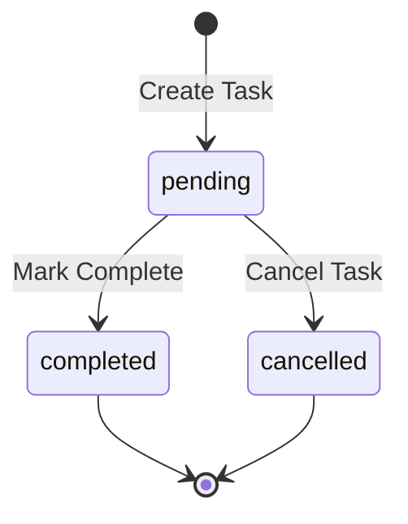

# Task Management Schema - Database Extension

> Added: 2026-01-10

---

## New Table: `lead_tasks`

```sql
CREATE TABLE IF NOT EXISTS lead_tasks (
    id UUID PRIMARY KEY DEFAULT gen_random_uuid(),
    lead_id UUID NOT NULL REFERENCES leads(id) ON DELETE CASCADE,
    
    -- Task details
    type VARCHAR(50) NOT NULL,
    scheduled_date DATE NOT NULL,
    scheduled_time TIME NOT NULL,
    notes TEXT,
    
    -- Outcome
    expected_outcome VARCHAR(100),
    actual_outcome TEXT,
    
    -- Status
    status VARCHAR(20) DEFAULT 'pending',
    
    -- Timestamps
    created_by UUID NOT NULL REFERENCES users(id) ON DELETE RESTRICT,
    created_at TIMESTAMP WITH TIME ZONE DEFAULT CURRENT_TIMESTAMP,
    updated_at TIMESTAMP WITH TIME ZONE DEFAULT CURRENT_TIMESTAMP,
    completed_at TIMESTAMP WITH TIME ZONE,
    cancelled_at TIMESTAMP WITH TIME ZONE,
    
    -- Constraints
    CONSTRAINT lead_tasks_type_valid CHECK (type IN (
        'call', 'email', 'meeting', 'follow_up', 
        'document_review', 'application_submit', 'visit', 'other'
    )),
    CONSTRAINT lead_tasks_status_valid CHECK (status IN ('pending', 'completed', 'cancelled')),
    CONSTRAINT lead_tasks_dates_valid CHECK (scheduled_date >= CURRENT_DATE)
);

-- Indexes
CREATE INDEX idx_lead_tasks_lead_id ON lead_tasks(lead_id);
CREATE INDEX idx_lead_tasks_status ON lead_tasks(status);
CREATE INDEX idx_lead_tasks_scheduled ON lead_tasks(scheduled_date, scheduled_time);
CREATE INDEX idx_lead_tasks_created_by ON lead_tasks(created_by);
CREATE INDEX idx_lead_tasks_type ON lead_tasks(type);

-- Combined index for common queries
CREATE INDEX idx_lead_tasks_pending ON lead_tasks(lead_id, status, scheduled_date) 
    WHERE status = 'pending';

COMMENT ON TABLE lead_tasks IS 'Tasks and follow-ups for leads';
COMMENT ON COLUMN lead_tasks.type IS 'call, email, meeting, follow_up, document_review, application_submit, visit, other';
COMMENT ON COLUMN lead_tasks.expected_outcome IS 'What the user expects to achieve from this task';
COMMENT ON COLUMN lead_tasks.actual_outcome IS 'What actually happened (filled when completed)';
```

---

## Task Types Enum

| Value | Display | Icon |
|-------|---------|------|
| `call` | Phone Call | 📞 |
| `email` | Send Email | 📧 |
| `meeting` | Meeting | 🤝 |
| `follow_up` | Follow Up | 🔄 |
| `document_review` | Document Review | 📄 |
| `application_submit` | Submit Application | 📝 |
| `visit` | Office Visit | 🏢 |
| `other` | Other | 📌 |

---

## Expected Outcomes Enum

| Value | Display |
|-------|---------|
| `get_documents` | Get missing documents |
| `confirm_interest` | Confirm interest in program |
| `schedule_meeting` | Schedule next meeting |
| `answer_questions` | Answer questions |
| `close_deal` | Close the deal |
| `follow_up_required` | Determine if follow-up needed |
| `gather_info` | Gather more information |
| `other` | Other |

---

## Status Flow



---

## API Endpoints Required

### POST `/api/leads/:leadId/tasks`
**Create new task**

```typescript
{
  type: 'call' | 'email' | 'meeting' | ...,
  scheduledDate: '2026-01-15',
  scheduledTime: '14:00',
  notes?: string,
  expectedOutcome?: string
}
```

### GET `/api/leads/:leadId/tasks`
**Get all tasks for a lead**

```typescript
// Response
{
  tasks: [
    {
      id: string,
      type: string,
      scheduledDate: string,
      scheduledTime: string,
      notes: string,
      expectedOutcome: string,
      status: 'pending' | 'completed' | 'cancelled',
      createdBy: User,
      createdAt: Date,
      completedAt?: Date,
      actualOutcome?: string
    }
  ]
}
```

### PUT `/api/leads/:leadId/tasks/:taskId/complete`
**Mark task as completed**

```typescript
{
  actualOutcome: string
}
```

### PUT `/api/leads/:leadId/tasks/:taskId/cancel`
**Cancel task**

---

## Sample Data

```sql
INSERT INTO lead_tasks (lead_id, type, scheduled_date, scheduled_time, notes, expected_outcome, status, created_by) VALUES
('lead-uuid', 'call', '2026-01-12', '14:00', 'Follow up on application status', 'confirm_interest', 'pending', 'user-uuid'),
('lead-uuid', 'email', '2026-01-11', '10:00', 'Send program details and fees', 'gather_info', 'completed', 'user-uuid');
```

---

**Version:** 1.0.0  
**Last Updated:** 2026-01-10
