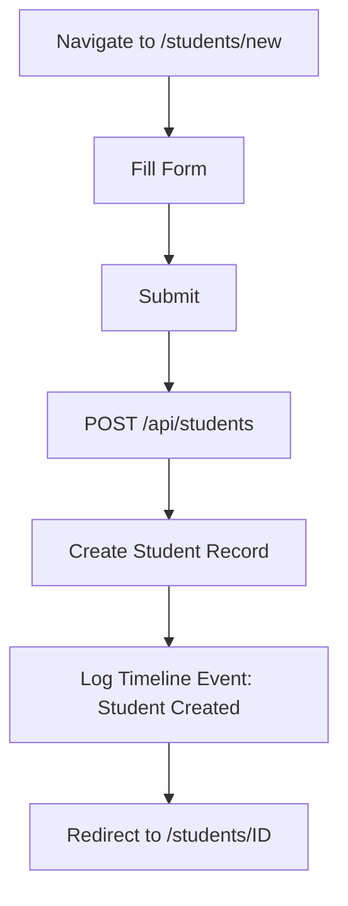
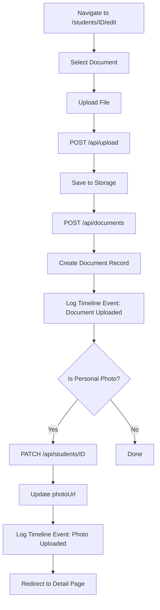
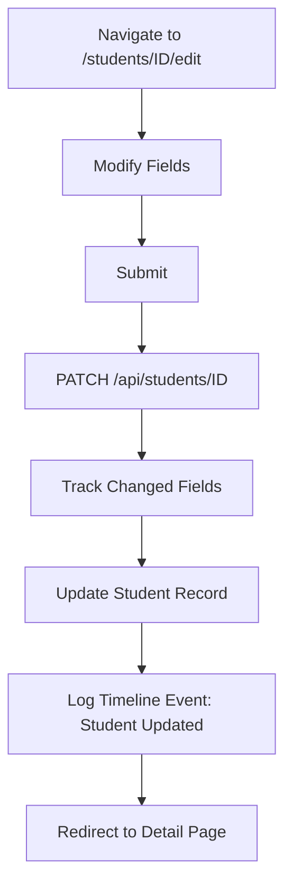

# Student Management - Complete Documentation

> **Module:** Student Management  
> **Last Updated:** January 16, 2026

---

## Overview

Complete documentation for the Student Management module including registration, detail view, editing, and timeline tracking.

---

## Module Components

### 1. Student List Page
**Path:** `/students`  
**Purpose:** Browse and search all students

**Features:**
- Searchable table
- Pagination
- Status filters
- Quick actions

**Documentation:** See main student-module.md

---

### 2. Student Registration
**Path:** `/students/new`  
**Purpose:** Register new students

**Features:**
- Multi-section form (6 sections)
- Conditional fields
- Validation
- Document upload

**Documentation:** [Student Form Module](file:///Users/mdarwish/CRM/docs/student-management/student-module.md)

---

### 3. Student Detail Page ⭐
**Path:** `/students/[id]`  
**Purpose:** View complete student information

**Features:**
- 6 tabbed sections
- Timeline tracking
- Application management
- Document viewing
- Creator information

**Documentation:** [Student Detail Page](file:///Users/mdarwish/CRM/docs/student-management/student-detail-page.md)

---

### 4. Student Edit Page
**Path:** `/students/[id]/edit`  
**Purpose:** Edit student information

**Features:**
- All fields editable
- Document upload
- Photo upload with auto-update
- Validation

**Documentation:** See student-module.md (Edit Mode section)

---

## Key Features

### ✅ Student Registration
- Complete 40+ field form
- Conditional field display
- Real-time validation
- International phone input
- Country/Degree dropdowns

### ✅ Document Management
- Upload multiple document types
- Local storage + Supabase fallback
- View/Download/Delete documents
- Photo auto-updates profile

### ✅ Timeline Tracking
- Automatic event logging
- Student created/updated events
- Document upload tracking
- Photo upload tracking
- Application events (future)

### ✅ Application Management
- View all student applications
- Add new applications
- Application status tracking
- Timeline integration

### ✅ Creator Attribution
- Track who created student (Agent/Staff)
- Display creator information
- Contact details for agents

---

## Database Schema

### Student Model

```prisma
model Student {
  id                 String   @id @default(cuid())
  // Student Information
  transferStudent    Boolean  @default(false)
  haveTc             Boolean?
  tcNumber           String?
  blueCard           Boolean  @default(false)
  status             String   @default("Applicant")
  
  // Personal Details
  firstName          String
  lastName           String
  fullName           String
  gender             String?
  dateOfBirth        DateTime?
  nationality        String?
  passportNumber     String?  @unique
  passportIssueDate  DateTime?
  passportExpiryDate DateTime?
  
  // Contact Information  
  email              String   @unique
  phone              String?
  mobile             String?
  addressLine1       String?
  cityDistrict       String?
  stateProvince      String?
  postalCode         String?
  addressCountry     String?
  
  // Family Information
  fatherName         String?
  fatherMobile       String?
  fatherOccupation   String?
  motherName         String?
  motherMobile       String?
  motherOccupation   String?
  
  // Academic Information
  educationLevelId   String?
  educationLevelName String?
  highSchoolCountry  String?
  highSchoolName     String?
  highSchoolGpa      Decimal?
  bachelorCountry    String?
  bachelorSchoolName String?
  bachelorGpa        Decimal?
  masterCountry      String?
  masterSchoolName   String?
  masterGpa          Decimal?
  
  // Files & Metadata
  photoUrl           String?
  documents          Json     @default("[]")
  agentId            String?
  assignedTo         String?
  tags               String[] @default([])
  metadata           Json     @default("{}")
  isActive           Boolean  @default(true)
  createdAt          DateTime @default(now())
  updatedAt          DateTime @updatedAt
  
  // Relations
  applications       Application[]
  studentDocuments   Document[]
  agent              Agent?
  timeline           TimelineEvent[]
}
```

### TimelineEvent Model

```prisma
model TimelineEvent {
  id            String   @id @default(cuid())
  entityType    String
  entityId      String
  studentId     String?
  applicationId String?
  eventType     String
  description   String
  metadata      Json     @default("{}")
  performedBy   String?
  createdAt     DateTime @default(now())
  
  student       Student?      @relation(fields: [studentId], references: [id])
  application   Application?  @relation(fields: [applicationId], references: [id])
}
```

---

## API Endpoints

### Student CRUD

| Method | Endpoint | Purpose |
|--------|----------|---------|
| GET | `/api/students` | List students |
| POST | `/api/students` | Create student |
| GET | `/api/students/[id]` | Get student details |
| PATCH | `/api/students/[id]` | Update student |
| DELETE | `/api/students/[id]` | Delete student |

### Document Management

| Method | Endpoint | Purpose |
|--------|----------|---------|
| POST | `/api/upload` | Upload file |
| POST | `/api/documents` | Create document record |
| DELETE | `/api/documents/[id]` | Delete document |

### Timeline (Automatic)

Timeline events are created automatically via:
- [`createTimelineEvent()`](file:///Users/mdarwish/CRM/lib/timeline.ts) helper function
- Called from Student/Document APIs
- No direct endpoint calls from frontend

---

## File Structure

```
app/(dashboard)/students/
├── page.tsx                  # List view
├── new/
│   └── page.tsx             # Registration form
└── [id]/
    ├── page.tsx             # Detail view (6 tabs)
    └── edit/
        └── page.tsx         # Edit form

app/api/students/
├── route.ts                 # GET (list), POST (create)
└── [id]/
    └── route.ts            # GET, PATCH, DELETE

app/api/documents/
└── route.ts                # POST, DELETE

app/api/upload/
└── route.ts                # File upload

lib/
├── timeline.ts             # Timeline helpers
└── local-storage.ts        # File storage

docs/student-management/
├── README.md               # This file
├── student-module.md       # Form documentation
└── student-detail-page.md  # Detail page documentation
```

---

## Workflows

### 1. Create New Student



### 2. Upload Document



### 3. Update Student



---

## Timeline Event Types

### Currently Implemented ✅

| Event Type | Trigger | Description Format |
|------------|---------|-------------------|
| Student Created | POST /api/students | "Student {name} was created" |
| Student Updated | PATCH /api/students/[id] | "Student information updated: {fields}" |
| Photo Uploaded | PATCH /api/students/[id] | "Profile photo updated" |
| Document Uploaded | POST /api/documents | "Document uploaded: {filename} ({type})" |

### Future Events 🔄

- Application Created
- Application Status Changed
- Student Status Changed
- Document Deleted
- Email Sent
- Task Created
- Note Added

---

## Storage Configuration

### Local Storage (Development)
**Location:** `/public/uploads/students/{studentId}/`  
**Format:** `{timestamp}_{random}_{filename}`

**Example:**
```
/public/uploads/students/cmkcg1ekw000cc9s894xiczco/
├── 1768461810198_h8spny_photo.png
├── 1768461615520_2emk0a_passport.pdf
└── 1768461490031_cegwvq_certificate.pdf
```

### Supabase Storage (Production)
**Bucket:** `student-documents`  
**Path:** `students/{studentId}/{filename}`

**Fallback Logic:**
1. Try Supabase first
2. If fails → use local storage
3. Return storage type in response

---

## Validation Rules

### Student Registration

**Required Fields:**
- firstName, lastName
- email (unique)
- passportNumber (unique)
- mobile

**Conditional Required:**
- tcNumber (if haveTc = true)
- bachelorCountry, bachelorSchoolName, bachelorGpa (for Master/PhD)
- masterCountry, masterSchoolName, masterGpa (for PhD)

**Validation:**
- Age ≥ 15 years
- Passport expiry > issue date
- Email format
- Mobile min 8 digits

---

## Features by Page

### Student Detail Page Tabs

#### 1. Overview
- Personal info
- Contact info
- Student category
- **Creator info** (Agent/Staff)

#### 2. Documents
- Grid display
- Upload/View/Delete
- File type badges

#### 3. Applications 🆕
- Application cards
- **Add Application button**
- Status tracking

#### 4. Academic
- Education level
- School history (High School/Bachelor/Master)

#### 5. Family
- Father info
- Mother info

#### 6. Timeline 🆕
- Auto-logged events
- Chronological display
- Event descriptions

---

## Recent Updates (Jan 16, 2026)

### Technical Improvements ✅

1. **Client Component Conversion**
   - Student Detail Page now Client Component
   - Client-side data fetching via fetch API (`/api/students/[id]`)
   - Removed server-side prisma calls
   - React hooks integration (useState, useEffect)
   - Fixed event handler issues

2. **Lead to Student Conversion**
   - Automatic creation from lead data
   - Redirect to Student Edit page (`/students/[id]/edit`)
   - Timeline event tracking
   - Document migration from lead

3. **Status Configuration Fix**
   - Local `statusConfig` definition
   - Fixed ReferenceError after Client conversion
   - Student statuses properly displayed

4. **UI Consistency**
   - Document grid layout matches Lead module
   - Consistent card-based design across modules
   - Image preview functionality

### Previous Updates (Jan 15, 2026)

### Added Features ✅

1. **Applications Tab**
   - View all student applications
   - Add Application button
   - Empty state with CTA

2. **Timeline Tab**
   - Automatic event logging
   - Student create/update tracking
   - Document upload tracking
   - Photo upload tracking

3. **Creator Section**
   - Shows who created student
   - Agent or Staff indicator
   - Contact information display

4. **Status Field**
   - Added `status` to Student model
   - Default: "Applicant"

5. **Timeline Infrastructure**
   - `lib/timeline.ts` helper library
   - `createTimelineEvent()` function
   - Field change tracking
   - Automatic logging in APIs

---

## Dependencies

### Core Libraries
```json
{
  "@prisma/client": "^6.19.1",
  "react-hook-form": "^7.x",
  "zod": "^3.x",
  "react-international-phone": "latest",
  "sonner": "latest"
}
```

### UI Components (Shadcn)
- Tabs
- Card
- Badge
- Button
- Form
- Input
- Select
- Calendar

---

## Environment Variables

```env
DATABASE_URL=postgresql://...
NEXT_PUBLIC_SUPABASE_URL=https://...
SUPABASE_SERVICE_ROLE_KEY=...
```

---

## Testing

### Manual Testing Checklist

**Registration:**
- [ ] Create new student
- [ ] Validate required fields
- [ ] Check conditional fields
- [ ] Verify timeline event created

**Detail Page:**
- [ ] All tabs display
- [ ] Timeline shows events
- [ ] Add Application button works
- [ ] Creator section correct

**Edit:**
- [ ] Update student info
- [ ] Upload documents
- [ ] Upload photo
- [ ] Timeline tracks changes

**Documents:**
- [ ] Upload various types
- [ ] View in new tab
- [ ] Delete documents
- [ ] Timeline logs uploads

---

## Troubleshooting

### Common Issues

**Timeline empty:**
- Check Prisma query includes `timeline`
- Verify `createTimelineEvent` called in APIs
- Check console logs

**Photo not updating:**
- Verify `photoUrl` in PATCH body
- Check file upload succeeded
- Refresh page

**Add Application 404:**
- Create `/applications/new` page
- Handle `studentId` query parameter

---

## Next Steps

### Recommended Enhancements

1. **Application Management**
   - Create application form page
   - Application status workflow
   - Timeline integration

2. **Advanced Timeline**
   - Filtering by event type
   - Date range selection
   - Export functionality

3. **Communication**
   - Email history
   - SMS tracking
   - Call logs

4. **Bulk Operations**
   - Bulk student import
   - Bulk email
   - Batch updates

---

## Related Documentation

- [Lead Management](file:///Users/mdarwish/CRM/docs/lead-management/)
- [Data Validation Rules](file:///Users/mdarwish/CRM/docs/data-validation-rules.md)
- [Permissions System](file:///Users/mdarwish/CRM/docs/permissions-system.md)

---

**Documentation Complete!** ✅  
All student management features are fully documented.
